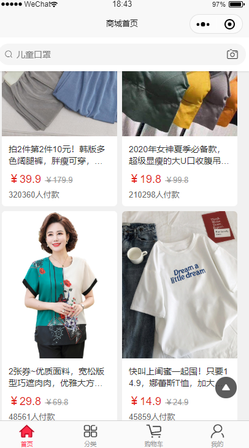
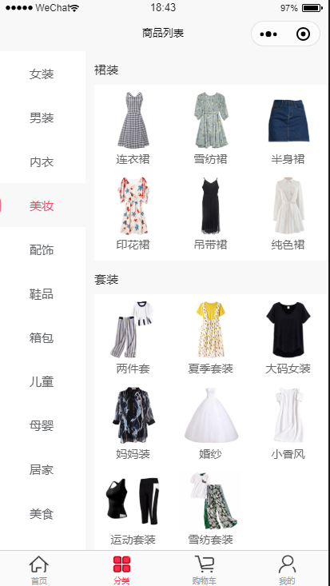
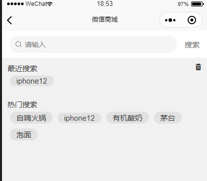
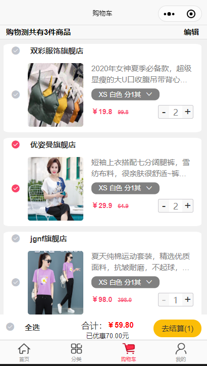

# vue_uniapp_shoppp
uniapp实现， 小程序 app端 仿京东，淘宝，苏宁易购等功能的电商项目。

2020-05-16
---

## 项目介绍

- 一款仿各类商城的小程序+app端的 应用，主要实现了整条, 购物车（三级全选，商品总价随商品数量变化），商品选择，
购买商品功能， 地址添加，修改功能，商品浏览历史， 商品搜索，商品秒杀倒计时，第三方登入，分享，拍照等功能， 
后续会相应增加
 里面的模板组件，参考了各类的应用
    - color
    - uni-mall 
    - ThorUI 
    相关链接的不太记得了， 有时间整理后， 更新更新一下

主要是功能适配小程序和app端， 后续会继续增加app端的相关sdk功能，

<video src="./video/mp1.MP4" controls="controls"></viedo>

